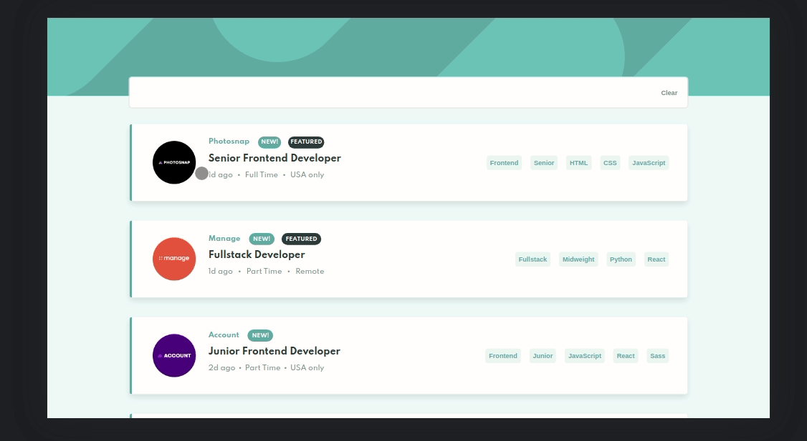

# Frontend Mentor - Job listings with filtering solution

This is a solution to the [Job listings with filtering challenge on Frontend Mentor](https://www.frontendmentor.io/challenges/job-listings-with-filtering-ivstIPCt). Frontend Mentor challenges help you improve your coding skills by building realistic projects.

## Table of contents

- [Overview](#overview)
  - [The challenge](#the-challenge)
  - [Screenshot](#screenshot)
  - [Links](#links)
- [My process](#my-process)
  - [Built with](#built-with)
  - [What I learned](#what-i-learned)
  - [Useful resources](#useful-resources)
- [Author](#author)

## Overview

This is the front-end mentor's eighteen challenge. The challenge is to build the "Job listings with filtering" and make it as close to the design as possible. Building the desing with whatever you want to finish, any language, framework or tools.

### The challenge

Users should be able to:

- View the optimal layout for the site depending on their device's screen size
- See hover states for all interactive elements on the page
- Filter job listings based on the categories

## Screenshot

### Mobile design

<p  align="center">
  </img>
</p>

### Tablets design

<p  align="center"></img></p>

### Desktop design

<p  align="center"></img></p>

### result of my work

<p  align="center"></img></p>
<p  align="center"></img></p>

### Links

- Solution URL: [My solution for this challenge](https://www.frontendmentor.io/solutions/job-listings-with-filtering-react-typescript-and-stylescomponens-kLWMlWkVR)
- Live Site URL: [check the result](https://jcdmeira-filter-jobs.netlify.app)

- My figma design: [Figma](https://www.figma.com/file/ayKxjGghHGL7FNiwVvhqOx/18-job-listings?node-id=0%3A1)

## My process

### Built with

- Mobile-first workflow
- typeScript
- [React](https://reactjs.org/) - JS library
- [Styled components](https://styled-components.com) - CSS in js with stiled components

### What I learned

Abaixo há a forma de adicionar novas tags ao array de filtros. Será adicionado os filtros já existentes e o novo filtro.
Há uma validação antes, para saber se o filtro já existe dentro do array. Isso é feito com o método "some" que retorna true se pelo menos um dos elementos do array passar na condição, que nesse caso é "o elemento do array é igual a palavra que está para ser adicionada no array?", onde o elemento do array é chamado de data e a palavra é o result, pois é o resultado após o tratamento para chegar no valor em questão após o click no botão da tag.

Para pegar o "value" de um elemento "button" foi feito com que se entenda o "button" como um "input" e também se passou um "value" como uma propriedade do mesmo.

</br>
<div align='right'>
Below is how to add new tags to the filter array. The existing filters and the new filter will be added.
There is a validation before, to know if the filter already exists inside the array. This is done with the "some" method that returns true if at least one of the array elements passes the condition, which in this case is "is the element of the array equal to the word that is to be added to the array?", where the element of the array is called data and the word is the result, as it is the result after treatment to reach the value in question after clicking on the tag's button.

To get the "value" of a "button" element, the "button" was understood as an "input" and also passed a "value" as a property of it.

</div>
</br>

```tsx
const onclick = (e: React.MouseEvent<HTMLButtonElement>) => {
  const result = (e.target as HTMLInputElement).value;

  const canAdd = currentFilters.some((data) => data === result);

  if (!canAdd) {
    const resultString = [...currentFilters, result];
    setFilters(resultString);
  }
};

<S.filterTag
  value={data.role}
  onClick={(e: React.MouseEvent<HTMLButtonElement>) => onclick(e)}
>
  {data.role}
</S.filterTag>;
```

</br>
O "useState" deve ser tipado quanto aos valores que irá receber. Então quando chamamos o componente passando os parâmetros necessários devemos também tipar os mesmo no componente.

</br>
<div align='right'>
The "useState" must be typed as to the values it will receive. So when we call the component passing the necessary parameters we must also type them in the component.
</div>
</br>

```tsx
const [filters, setFilters] = useState<string[]>([]);
<SearchJob currentFilters={filters} setFilters={setFilters} />;
```

</br>
Essa tipagem foi feita da forma de uma 'interface'. Sendo que elas são compatíveis com o tipo aderido ao 'useState'.

</br>
<div align='right'>
This typing was done in the form of an 'interface'. Since they are compatible with the type adhered to 'useState'.

</div>
</br>

```tsx
interface SearchJobInterface {
  currentFilters: string[];
  setFilters: React.Dispatch<React.SetStateAction<string[]>>;
}

export const SearchJob = ({
  currentFilters,
  setFilters,
}: SearchJobInterface): JSX.Element => {};
```

</br>
A mostra ou não dos empregos é feita por uma flag de controle chamada "canShow", no useState é inserido inicialmente todos como valor "true", então todos são mostrados.
O "useEffect" remonta o componente todas as vezes que os filtros mudarem. Então atribui todos os filtros a uma constante. E cria outra constante com quais dados há nos empregos disponíveis, relevando apenas os elementos que podem ser afetados pelos filtros.
Então é feito a comparação, "para cara filtro existente em filtersTexts cheque se ele está incluido nos textsToCompare", isso faz com que dentro de cada iteração do map percorrendo o allJobs se crie um textsToCompare com os dados do que aquele emprego tem, compare com as tags de filtro em filterText e se todas estiverem inclusas é um caso 'true' se não é um caso 'false'. Cada um retorna a flag de controle corresponde, preenchendo o array updatedJobs com os empregos que devem ser atualizados. Que são atribuidos ao allJobs no final.

</br>
<div align='right'>
The display or not of the jobs is done by a control flag called "canShow", in the useState all are initially inserted as "true" value, then all are shown.
"useEffect" reassembles the component every time the filters change. Then assign all filters to a constant. And it creates another constant with which data is available on available jobs, revealing only the elements that can be affected by the filters.
Then the comparison is done, "for each filter that exists in filtersTexts check if it is included in the textsToCompare", this makes that within each iteration of the map going through allJobs it creates a textsToCompare with the data that that job has, compare with the filter tags in filterText and if all are included it is a 'true' case if not a 'false' case. Each returns the corresponding control flag, filling the updatedJobs array with the jobs that should be updated. Which are assigned to allJobs at the end.
</div>
</br>

```tsx
const [allJobs, setAllJobs] = useState(
  data.map((job) => ({ ...job, canShow: true })),
);

useEffect(() => {
  const filterTexts = filters.map((filter) => filter);

  const updatedJobs = allJobs.map((job) => {
    const textsToCompare = [
      job.role,
      job.level,
      ...job.languages,
      ...job.tools,
      job.new && 'New',
      job.featured && 'Featured',
    ];

    if (
      filterTexts.every((filterText) => textsToCompare.includes(filterText))
    ) {
      return { ...job, canShow: true };
    } else {
      return { ...job, canShow: false };
    }
  });

  setAllJobs(updatedJobs);
  // eslint-disable-next-line react-hooks/exhaustive-deps
}, [filters]);
```

</br>
Para adicionar New e Featured foram feitas funções separadas, que seguem a mesma lógica, mas passando uma string para ser comparada.

</br>
<div align='right'>
To add New and Featured were made separate functions, which follow the same logic, but passing a string to be compared.
</div>
</br>

```tsx
const handleAdd = (tag: string) => {
  const canAdd = currentFilters.some((data) => data === tag);

  if (!canAdd) {
    const resultString = [...currentFilters, tag];
    setFilters(resultString);
  }
};

<div className="new" onClick={() => handleAdd('New')}>
  <h2>New!</h2>
</div>

<div className="featured" onClick={() => handleAdd('Featured')}>
  <h2>Featured</h2>
</div>
```

### Useful resources

- [react tutorial](https://pt-br.reactjs.org/tutorial/tutorial.html) - This helped me structure the components and build the proposed page.
- [my figma design](https://www.figma.com/file/ayKxjGghHGL7FNiwVvhqOx/18-job-listings?node-id=0%3A1) - My figma design for help anyone who wants to build this challenge.
- [CSS units conversor - px to VH/VW/REM](https://it-news.pw/pxtovh/) - CSS units conversor .
- [Converting Colors](https://convertingcolors.com) - HSL for all color systems.

## Author

- Personal Page - [Jean Carlos De Meira](https://jcdmeira.github.io)
- Frontend Mentor - [@JCDMeira](https://www.frontendmentor.io/profile/JCDMeira)
- Instagram - [@jean.meira10](https://www.instagram.com/jean.meira10/)
- GitHub - [JCDMeira](https://github.com/JCDMeira)

```

```
