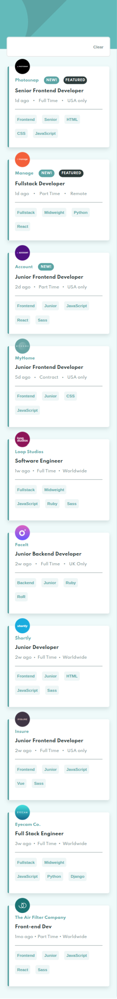
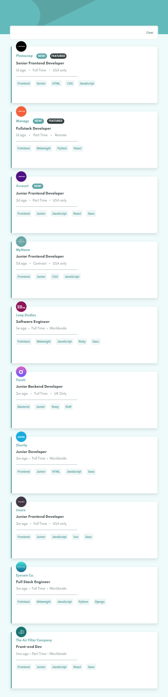
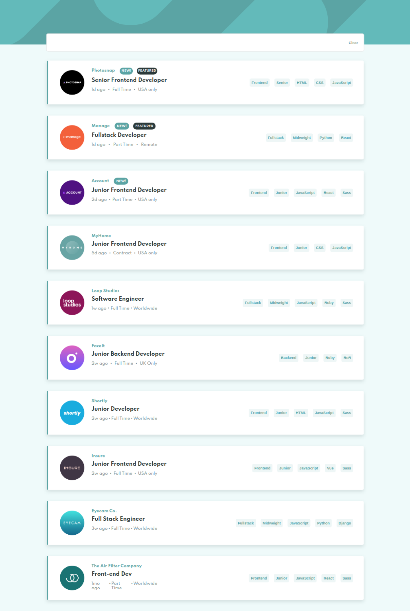
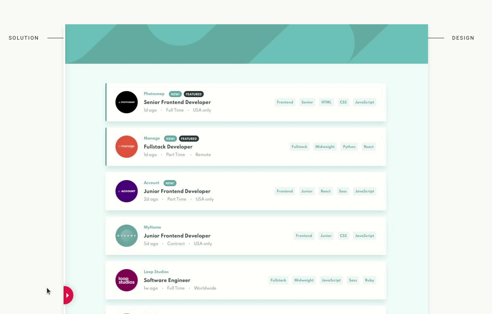

# Frontend Mentor - Job listings with filtering solution

This is a solution to the [Job listings with filtering challenge on Frontend Mentor](https://www.frontendmentor.io/challenges/job-listings-with-filtering-ivstIPCt). Frontend Mentor challenges help you improve your coding skills by building realistic projects.

## Table of contents

- [Overview](#overview)
  - [The challenge](#the-challenge)
  - [Screenshot](#screenshot)
  - [Links](#links)
- [My process](#my-process)
  - [Built with](#built-with)
  - [What I learned](#what-i-learned)
  - [Useful resources](#useful-resources)
- [Author](#author)

## Overview

This is the front-end mentor's eighteen challenge. The challenge is to build the "Job listings with filtering" and make it as close to the design as possible. Building the desing with whatever you want to finish, any language, framework or tools.

### The challenge

Users should be able to:

- View the optimal layout for the site depending on their device's screen size
- See hover states for all interactive elements on the page
- Filter job listings based on the categories

## Screenshot

### Mobile design

<p  align="center">
  </img>
</p>

### Tablets design

<p  align="center"></img></p>

### Desktop design

<p  align="center"></img></p>

<!-- ### result of my work

<p  align="center"></img></p> -->

### Links

<!--
- Solution URL: [My solution for this challenge](https://www.frontendmentor.io/solutions/single-price-grid-with-reactjs-YR5dhXAtZ)
- Live Site URL: [check the result](https://jcdmeira-single-price.netlify.app)-->

- My figma design: [Figma](https://www.figma.com/file/ayKxjGghHGL7FNiwVvhqOx/18-job-listings?node-id=0%3A1)

## My process

### Built with

- Mobile-first workflow
- typeScript
- [React](https://reactjs.org/) - JS library
- [Styled components](https://styled-components.com) - CSS in js with stiled components

### What I learned

```tsx
const onclick = (e: React.MouseEvent<HTMLButtonElement>) => {
  const result = (e.target as HTMLInputElement).value;

  const canAdd = currentFilters.some((data) => data === result);

  if (!canAdd) {
    const resultString = [...currentFilters, result];
    setFilters(resultString);
  }
};

<S.filterTag
  value={data.role}
  onClick={(e: React.MouseEvent<HTMLButtonElement>) => onclick(e)}
>
  {data.role}
</S.filterTag>;
```

```tsx
const [filters, setFilters] = useState<string[]>([]);
<SearchJob currentFilters={filters} setFilters={setFilters} />;
```

```tsx
interface SearchJobInterface {
  currentFilters: string[];
  setFilters: React.Dispatch<React.SetStateAction<string[]>>;
}

export const SearchJob = ({
  currentFilters,
  setFilters,
}: SearchJobInterface): JSX.Element => {};
```

```tsx
const [allJobs, setAllJobs] = useState(
  data.map((job) => ({ ...job, canShow: true })),
);

useEffect(() => {
  const filterTexts = filters.map((filter) => filter);

  const updatedJobs = allJobs.map((job) => {
    const textsToCompare = [
      job.role,
      job.level,
      ...job.languages,
      ...job.tools,
      job.new && 'New',
      job.featured && 'Featured',
    ];

    if (
      filterTexts.every((filterText) => textsToCompare.includes(filterText))
    ) {
      return { ...job, canShow: true };
    } else {
      return { ...job, canShow: false };
    }
  });

  setAllJobs(updatedJobs);
  // eslint-disable-next-line react-hooks/exhaustive-deps
}, [filters]);
```

```tsx
const onclick = (e: React.MouseEvent<HTMLButtonElement>) => {
  const result = (e.target as HTMLInputElement).value;

  const canAdd = currentFilters.some((data) => data === result);

  if (!canAdd) {
    const resultString = [...currentFilters, result];
    setFilters(resultString);
  }
};

const handleAdd = (tag: string) => {
  const canAdd = currentFilters.some((data) => data === tag);

  if (!canAdd) {
    const resultString = [...currentFilters, tag];
    setFilters(resultString);
  }
};
```

### Useful resources

- [react tutorial](https://pt-br.reactjs.org/tutorial/tutorial.html) - This helped me structure the components and build the proposed page.
- [my figma design](https://www.figma.com/file/ayKxjGghHGL7FNiwVvhqOx/18-job-listings?node-id=0%3A1) - My figma design for help anyone who wants to build this challenge.
- [CSS units conversor - px to VH/VW/REM](https://it-news.pw/pxtovh/) - CSS units conversor .
- [Converting Colors](https://convertingcolors.com) - HSL for all color systems.

## Author

- Personal Page - [Jean Carlos De Meira](https://jcdmeira.github.io)
- Frontend Mentor - [@JCDMeira](https://www.frontendmentor.io/profile/JCDMeira)
- Instagram - [@jean.meira10](https://www.instagram.com/jean.meira10/)
- GitHub - [JCDMeira](https://github.com/JCDMeira)

```

```
